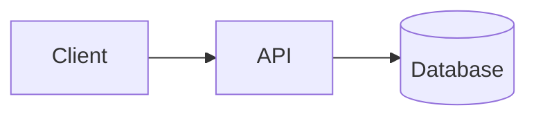

<!-- TEMPLATE:UNFILLED — this becomes the project's public README. See the instantiation
     steps in the template README: replace this file's content, then rename it to README.md. -->
# <PROJECT NAME>

<!-- One sentence: what it does and who it is for. This line is the first thing a
     reviewer reads on GitHub. Make it concrete. -->

**Live:** <url> · **API docs:** <url>

---

## What this is

<!-- Two or three paragraphs. The problem, the approach, and what is interesting about
     the solution. Written for someone who has not read anything else. -->

## Screenshot

<!-- One image, above the fold. A reviewer decides whether to keep reading here. -->

## How it works

<!-- The architecture in one diagram and one paragraph. Depth lives in docs/01-DESIGN.md;
     link there rather than expanding here. -->



## Documentation

This project was built through a documented process. In reading order:

| Document | What it covers |
|----------|----------------|
| [Requirements](docs/00-PRD.md) | The problem, the users, what is out of scope |
| [System design](docs/01-DESIGN.md) | Architecture, data model, API contract, threat model |
| [Decision log](docs/02-DECISIONS.md) | Every consequential choice and why it was made |
| [Quality bar](docs/03-QUALITY.md) | Definition of Done, test strategy, CI gates |
| [Build plan](docs/04-PLAN.md) | Sprints and acceptance criteria |
| [Runbook](docs/07-RUNBOOK.md) | Deploy, roll back, recover |
| [Case study](docs/08-CASE-STUDY.md) | The short version, for readers in a hurry |

## Running it locally

```bash
# clone, then:
cp .env.example .env     # fill in the values
```

<!-- The real commands. Verify them on a clean checkout before shipping this file —
     a broken quickstart is worse than none. -->

## Verifying

One command decides whether the project is green. CI runs the same one.

```bash
./scripts/verify.sh
```

## Data

<!-- If the data is synthetic, say so here, plainly and early. Volunteering it is what
     makes the rest of the project credible. -->

## Licence

MIT — see [LICENSE](LICENSE).
