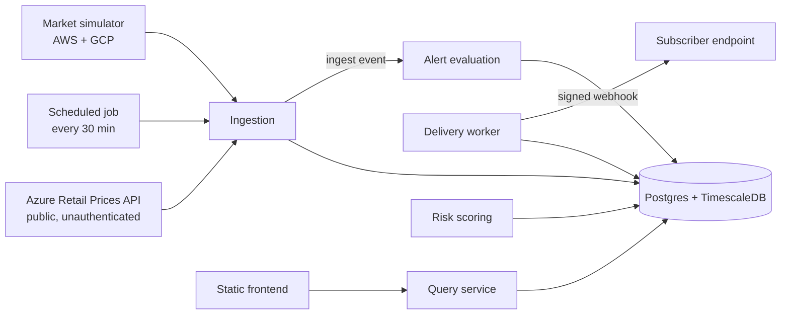
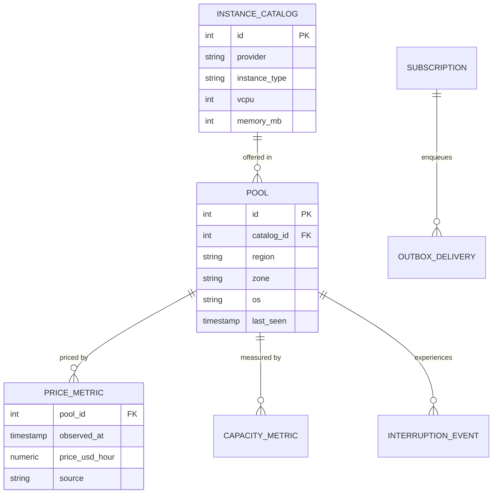

# Preempt — system design

Phase 1. The durable reference for how this system works. Written before code, kept
current as the system changes.

## Context and goals

Preempt answers one question: for a machine of a given size, which cloud is cheapest right
now on the discount tier, and how likely is that machine to be taken away? See `00-PRD.md`
for who is asking and why.

**Goals**

- One comparable price per machine across three providers whose pricing schemes disagree.
- Ninety days of price history, queryable.
- Interruption risk per pool, reported with its own uncertainty.
- Alerts that actually arrive, and are not delivered twice.
- All of it running at zero cost, always reachable.

**Non-goals**

- Provisioning anything. Preempt reads and reports; it never holds a cloud credential that
  can spend money.
- Being right about real interruptions. Two of three providers are simulated, so the
  prediction demonstrates a method rather than forecasting reality. The provenance rule
  below makes that structural rather than a disclaimer.

## The constraint that shapes everything

The free tier is not a deployment detail here. It is the dominant design constraint, and
two numbers drive most of what follows.

**Neon's free plan allows 100 compute-unit-hours per project per month, roughly 400 hours
at the smallest compute size. A month is about 730 hours.** The database therefore cannot
be awake continuously, and scale-to-zero after five minutes cannot be disabled on the free
plan.

That kills the obvious design. A five-minute ingestion tick keeps the database permanently
awake, exhausts the month's compute in about sixteen days, and suspends the project for
the remainder — most likely unattended. Ingestion cadence is set by this budget, not by
preference:

| Cadence | Hours awake per month | Fits in 400 |
|---------|----------------------|-------------|
| 5 minutes | ~730 | No — suspends around day 16 |
| 30 minutes | ~124 | Yes |
| Hourly | ~62 | Yes, comfortably |

**Thirty minutes** is the choice: headroom for demo traffic on top, frequent enough that a
price chart looks alive. See D-002.

The second number is **0.5 GB of storage per project**, which produces the row budget
below and caps how many machine types the system tracks.

## Architecture



| Component | Owns | Explicitly does not |
|-----------|------|---------------------|
| Ingestion | Fetching, normalising, writing observations | Decide whether an alert fires |
| Market simulator | Synthetic AWS and GCP price and capacity signals | Touch any real provider |
| Query service | Search, compare, history, provider summary | Write anything |
| Alert evaluation | Detecting a rule crossing, enqueuing to the outbox | Perform HTTP delivery |
| Delivery worker | Draining the outbox with retries and signing | Decide whether a rule crossed |
| Risk scoring | Scoring pools, publishing calibration | Present a number without its uncertainty |

Evaluation and delivery are deliberately separate. Evaluation decides and writes a row;
delivery is the only component that talks to the network. Anything reaching the outbox
survives a crash, and a slow subscriber cannot stall ingestion.

## Data model

Three fact tables are hypertables partitioned on observation time. Everything else is
ordinary relational.



**The pool is the unit of everything.** A pool is one machine type, in one zone, for one
operating system. Risk is a property of a pool rather than of an individual machine,
because reclamations within a pool are driven by the same underlying capacity pressure.
This carries forward a decision from prior work in this domain; D-004 records it together
with an honest note about the state of its supporting evidence.

**Key design.** `price_metric` is keyed on `(pool_id, observed_at)`. Writes are
store-on-change: a row is written only when the price differs from the last one recorded
for that pool. Re-observing an unchanged price updates `pool.last_seen` instead of
appending. This is what makes 0.5 GB viable.

**Row budget.** At roughly 100 bytes per row including index overhead, 0.5 GB is about
five million rows in theory. Targeting two million leaves real headroom.

| Tracked pools | Ticks/day | Change rate | Rows over 90 days |
|---------------|-----------|-------------|-------------------|
| 500 | 48 | 10% | ~216,000 |
| 500 | 48 | 100% (worst case) | ~2,160,000 |

**500 tracked pools** is therefore the cap, and it holds even if every price changes on
every tick. This is why the simulator tracks a curated subset rather than the full
catalogue-by-zone cross product.

**Retention.** Ninety days, enforced by a scheduled delete rather than a Timescale
retention policy, because policy jobs require a background worker that a scale-to-zero
database does not have.

## API contract

The frontend is built against this, so it is settled here rather than improvised during
implementation. The OpenAPI document generated from these routes is the input to
`06-UI-SPEC.md`.

| Method | Path | Purpose | Auth |
|--------|------|---------|------|
| GET | `/api/v1/health` | Liveness, and whether ingestion is fresh | none |
| GET | `/api/v1/instances` | Search pools by vCPU, memory, provider, region | none |
| GET | `/api/v1/compare` | Cheapest equivalent per provider for a given size | none |
| GET | `/api/v1/pools/{id}/history` | Price series over a window | none |
| GET | `/api/v1/pools/{id}/risk` | Interruption risk, interval, sample size | none |
| GET | `/api/v1/prediction/calibration` | Reliability diagram and Brier score | none |
| POST | `/api/v1/subscriptions` | Create an alert rule | API key |
| GET | `/api/v1/subscriptions` | List rules | API key |
| DELETE | `/api/v1/subscriptions/{id}` | Remove a rule | API key |

Reads are open. Anything that writes, or that would expose a stored webhook URL, requires
a key — including the list endpoint.

**Error shape.** One body for every failure, defined once.

```json
{ "error": { "code": "invalid_field", "message": "region is not a supported value" } }
```

**Provenance is a mandatory field.** Every response carrying a price or a prediction
includes a non-nullable `provenance` object. It is structurally required, not a footnote:

```json
{ "provenance": { "source": "simulated", "provider": "aws", "note": "Synthetic data. Not real AWS pricing." } }
```

`source` is `measured` for Azure and `simulated` for AWS and GCP. A comparison spanning
both is `mixed` and says so in the payload, not in a tooltip. A consumer cannot read a
price out of this API without also receiving the statement of what it is.

## Threat model

| Threat | Scenario | Mitigation, or accepted with reason |
|--------|----------|-------------------------------------|
| Spoofing | Forged webhook claiming to come from Preempt | HMAC-SHA256 over the body, compared in constant time |
| Tampering | Body altered in transit | Same signature covers the body; HTTPS only |
| Repudiation | Subscriber denies receiving an alert | The outbox row records attempts, timestamps, and final status |
| Information disclosure | Stored webhook URLs readable by anyone | Every subscription route requires an API key, reads included |
| Denial of service | Ingestion stalled by a slow subscriber | Delivery is a separate worker draining a queue; ingestion makes no outbound request |
| Elevation of privilege | Preempt used to reach internal hosts | SSRF guard rejects loopback, private, link-local, and metadata addresses, at registration and again at delivery |

**Trust boundaries.** Untrusted input enters at exactly three points: query parameters on
the public read API, the subscription body (which contains an attacker-chosen URL), and
the Azure API response. Validation lives at those three points and nowhere else.

**Accepted, with reasons.** No encryption at rest beyond what the managed database
provides — the data is public pricing and synthetic observations. The webhook signing
secret is stored reversibly because HMAC requires the original value; a one-way hash is
impossible here, and a database-read attacker is outside this threat model.

## Observability

| Signal | How | Answers |
|--------|-----|---------|
| Structured logs to stdout | JSON lines, one per request | What happened, and in what order |
| Request ID on every response | header, echoed into every log line | Which log lines belong to the request being complained about |
| Freshness in `/health` | age of the newest observation | Whether ingestion silently stopped |
| External uptime check | free monitor against `/health`, every 15 minutes | Whether the platform suspended the service overnight |

**Deliberately out of scope:** metrics backend, distributed tracing, dashboards. One
service, one database, one operator — these would add operational surface without
answering a question the four signals above cannot.

## Environments

| Environment | Purpose | Data | Runs on |
|-------------|---------|------|---------|
| local | development | simulated, plus live Azure | docker compose |
| test | automated tests | fixtures | a dedicated database, never the dev one |
| prod | the live demo | live Azure, simulated AWS and GCP | free tier |

**There is no staging.** With one production database, one operator, and a zero-cost
ceiling, staging would double the operational surface to catch problems that CI and a
seed rebuild already cover. The compensating controls: migrations are forward-only and run
from CI, the seed script rebuilds the entire demo dataset from nothing, and the test suite
runs against its own database so it cannot touch production.

That last control is a scar, not a preference. In prior work in this domain a test fixture
truncated the same database the demo ran on, destroying demo data and then breaking the
next backfill through leftover rows.

## Failure modes

| What fails | Detected by | Behaviour |
|------------|-------------|-----------|
| Azure API unreachable | ingestion error log; `/health` freshness ages | Azure pools keep their last value with an ageing `last_seen`; simulated providers continue |
| Azure changes its response shape | normalisation raises on an unexpected field | That provider's ingest fails and is reported; the tick still commits the other two |
| Scheduler misses a run | freshness exceeds two intervals | The next tick catches up; history shows a visible gap rather than interpolation |
| Monthly database compute exhausted | queries fail outright | The failure the 30-minute cadence exists to prevent; the uptime monitor surfaces it |
| Service cold-started | first request is slow | The frontend shows a skeleton, not a spinner — specified in `06-UI-SPEC.md` |
| Subscriber endpoint down | delivery attempt fails | Retry with exponential backoff and jitter, dead-letter after the cap, count exposed via the API |

## Alternatives considered

| Option | Why not |
|--------|---------|
| Render for the API | Free services sleep after 15 minutes with a 30–60 second cold start. A demo that takes a minute to load during an interview has already failed. |
| Fly.io | The free tier no longer exists for new accounts as of 2026; the trial is two VM-hours. |
| Oracle Cloud Always Free | The only genuinely always-on free compute, but instances are reclaimed when 95th-percentile CPU stays below 20% over seven days — precisely the shape of a low-traffic demo API. |
| Supabase for the database | Free projects pause after seven days without API traffic. The tick prevents it, but it makes the demo's survival depend on the scheduler never breaking. |
| `pg_cron` as the scheduler | Runs only while the compute is active, so on a scale-to-zero database it cannot be the thing that wakes it. |
| Timescale compression | Unsupported on Neon's free tier. Prior work never used it, so nothing is lost. |
| Fully simulated data across all three providers | Simpler and more internally consistent, but Azure's real prices are free to obtain. Declining genuinely available real data to keep the story tidy is the wrong trade. |

## Resolved questions

The four questions left open in `00-PRD.md`, each now a decision-log entry.

1. **Real Azure data — yes.** The Retail Prices API is public and unauthenticated,
   confirmed by a live call returning real spot prices. One provider measured, two
   simulated, labelled per row. D-001.
2. **Unit of risk — the pool.** Carried forward from prior work, with its evidence
   honestly qualified. D-004.
3. **Where it runs — Koyeb, Neon, and an external scheduler.** Chosen on idle-suspension
   and compute-budget numbers. D-002, D-003.
4. **What carries over.** The delivery engine, the three-way prediction split, and the
   schema shape port across; cadence and storage strategy are new work, because the
   constraints are new. D-005.

## Open questions

- **Which external scheduler.** Scheduled workflows on shared runners are free but can be
  delayed, and are disabled after a period of repository inactivity. A 30-minute cadence
  tolerates delay; the inactivity rule needs confirming before Sprint 0 commits to it.
- **Whether 500 pools is the right cap**, or whether a smaller set with more interesting
  variety demonstrates the comparison better. The budget permits 500; the product may not
  need them.
