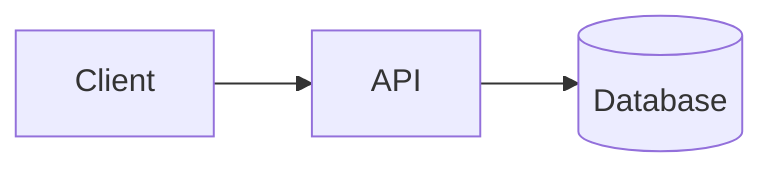
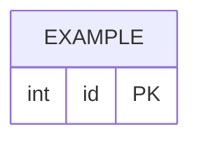

<!-- TEMPLATE:UNFILLED — delete this line once this document is genuinely filled in. -->
# System design

Phase 1. The durable reference for how this system works. Written before code, kept
current as the system changes. If a reviewer reads one document, it is this one.

## Context and goals

<!-- Restate, in two or three sentences, what 00-PRD.md asked for. A reader should
     not have to open the PRD to follow this document. -->

**Goals**

-

**Non-goals** <!-- Things this design deliberately does not attempt, and why. -->

-

## Architecture

<!-- The system in one diagram, then the components in prose. Name each component,
     what it owns, and what it must never do. Mermaid renders on GitHub. -->



| Component | Owns | Explicitly does not |
|-----------|------|---------------------|
| | | |

## Data model

<!-- Tables or collections, keys, and the reasoning behind the shape. Call out the
     unique/primary key of every table — key design is where data bugs come from.
     Note retention and growth: what does this table look like after a year? -->



## API contract

<!-- The seam between backend and frontend. The frontend is built against this, so it
     is settled here, in Phase 1, not improvised during implementation.
     Link to the OpenAPI spec once it exists. -->

| Method | Path | Purpose | Auth |
|--------|------|---------|------|
| GET | `/api/v1/health` | Liveness | none |

**Error shape** <!-- One consistent error body across every endpoint. Define it once. -->

```json
{ "error": { "code": "", "message": "" } }
```

## Threat model

<!-- Lightweight STRIDE. For each row: what could an attacker do, and what stops them?
     "Out of scope" is a valid answer when written down with a reason — the point is
     that the risk was considered, not that every risk is mitigated. -->

| Threat | Scenario | Mitigation / accepted with reason |
|--------|----------|-----------------------------------|
| Spoofing | | |
| Tampering | | |
| Repudiation | | |
| Information disclosure | | |
| Denial of service | | |
| Elevation of privilege | | |

**Trust boundaries** <!-- Where does untrusted input enter? Validate at exactly those points. -->

-

## Environments

<!-- Free tier means no staging. Say so explicitly rather than leaving it implied,
     and say what compensates for its absence. -->

| Environment | Purpose | Data | Hosted on |
|-------------|---------|------|-----------|
| dev | local development | synthetic | localhost |
| prod | the live demo | synthetic, labeled as such | |

## Observability

<!-- The honest solo minimum is three things. Anything beyond them should be recorded
     here as a deliberate exclusion, so it reads as considered rather than forgotten. -->

| Signal | How | Answers |
|--------|-----|---------|
| Structured logs to stdout | JSON lines, one per request | What happened, and in what order |
| Request ID on every response | header, echoed into every log line | Which log lines belong to the request a user is complaining about |
| Uptime check against `/api/v1/health` | free external monitor | Whether the free tier suspended the service overnight |

**Deliberately out of scope:** metrics backend, distributed tracing, dashboards, log
retention beyond the provider default. One service, one database, synthetic data, and a
single operator — these would add operational surface without answering a question the
three signals above cannot.

## Failure modes

<!-- What breaks, how it is detected, and what the system does about it. A design that
     only describes the happy path is not finished. -->

| What fails | Detected by | Behavior |
|------------|-------------|----------|
| | | |

## Alternatives considered

<!-- Two or three real options that were rejected, with the reason. This is the section
     interviewers ask about. Record the rejected option honestly — including the part
     of it that was genuinely better. -->

| Option | Why not |
|--------|---------|
| | |

## Open questions

-
